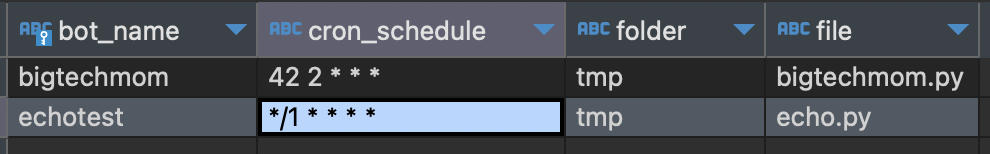
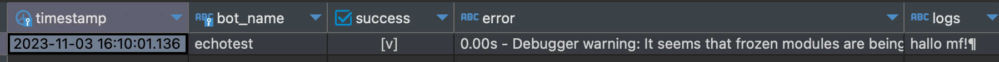

prefect, dagster and so on are all quite complex for just executing a python file, therefore I wrote a simple executor for python files. It is not a full fledged executor, but it is enough for my use case. It is also a good starting point for writing your own executor.

## install

`pip install -r requirements.txt`

The script needs a postgres database.

Next prepare the .env file with your values. you can copy the .env.example file and fill in the values.

```
BASE_FOLDER = environ[
    "BASE_FOLDER"
]  # the base folder of your project, where all the python scripts are. needs to be absolute path
PYTHON_PATH = environ[
    "PYTHON_PATH"
]  # the path to the python executable where requirements of your scripts are installed. unsure? type which python3 in your terminal
```

## usage

1. either add schedules interactively with the add_schedule.py script, or fill in the postgres values right away



2. run the run.py script and it grabs all schedules from the db. logs and errors are written into the "run_results" table


### recommended: running as linux service

change the directry in the [service file](pyscheduler.service) to wherever you downloaded this repo

```
WorkingDirectory=/root/pyscheduler/
```

then copy it to the systemd folder

```
sudo cp pyscheduler.service /etc/systemd/system/
```

and enable it

```
sudo systemctl enable pyscheduler.service --now
```

you can check logs with 

```
sudo journalctl -u pyscheduler.service
```